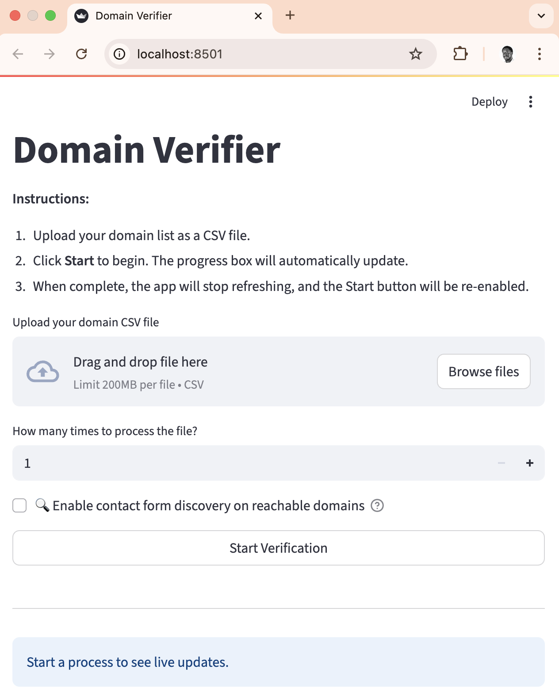

# Domain-Verifier: Contact Form Detection System

A sophisticated machine learning system that automatically detects contact forms on websites using advanced NLP and vector search optimization techniques.

## 🎯 Overview

Domain-Verifier is a two-stage contact form detection system that:

1. **Classifies website links** using a trained ML model to identify contact-related pages
2. **Detects actual contact forms** on those pages using HTML parsing and iframe detection

The system uses advanced data augmentation and vector search optimization to achieve 99.2% accuracy in distinguishing between service pages and contact pages.

## 🏗️ Architecture

```
Domain-Verifier/
├── contact_form_crawler.py      # Main crawler with ML classification
├── utils/
│   └── contact_link_trainer.py  # ML model training with vector search
├── models/                      # Trained model files
│   ├── contact_classifier.pkl
│   ├── sentence_model/
│   └── model_metadata.json
├── test_single_form_finder.py   # Testing script
└── requirements.txt
```

## 🚀 Quick Start

### Installation

```bash
# Clone the repository
git clone <repository-url>
cd Domain-Verifier

# Install dependencies
pip install -r requirements.txt

# Install Playwright browsers (for web crawling)
playwright install
```

### Basic Usage

```bash
# Test on a single domain
python test_single_form_finder.py https://example.com

# Or use the crawler directly
python -c "
from contact_form_crawler import ContactFormCrawler
import asyncio

async def main():
    crawler = ContactFormCrawler('https://example.com')
    forms = await crawler.find_contact_forms()
    print(f'Found {len(forms)} contact forms')

asyncio.run(main())
"
# Generate the simple CSV RESULT with a specifi csv and loglevel INFO
python test_contact_crawler.py --csv live_test_sample.csv --log-level INFO

# Generate the simple CSV RESULT with a specifi csv and limit
python test_contact_crawler.py --csv live_test_sample.csv --limit 2 --log-level INFO

# Generate the simple CSV RESULT with a specifi csv and column name for csv
python test_contact_crawler.py --csv live_test_sample.csv --columnName "website" --log-level INFO

# Generate both simple and detailed CSV RESULT with detail
python test_contact_crawler.py --csv live_test_sample.csv --limit 2 --detail --log-level INFO

# Generate both simple and detailed CSV RESULT to desired output folder
python test_contact_crawler.py --csv live_test_sample.csv --limit 2 --output-dir my_results --log-level INFO
```

## 🤖 Machine Learning Model

### Model Architecture

- **Embedding Model**: `all-MiniLM-L6-v2` (Sentence Transformers)
- **Classifier**: Logistic Regression with L2 regularization
- **Features**: Text embeddings + URL path context
- **Optimization**: Vector search-based critical sample training

### Training Data Augmentation

The model uses sophisticated data augmentation techniques:

```python
# Synonym replacement
"contact" → ["reach", "get in touch", "connect", "message"]
"about" → ["company", "story", "team", "who we are"]

# Case variations
"Contact Us" → ["CONTACT US", "Contact Us", "contact us"]

# Spacing variations
"Contact Us" → ["ContactUs", "Contact-Us"]
```

### Vector Search Optimization

Based on [Pinecone's vector search approach](https://www.pinecone.io/learn/classifier-train-vector-search/), the system:

1. **Identifies critical samples** near the decision boundary
2. **Focuses training** on confusing examples (like HVAC service pages)
3. **Uses balanced weights** (70% full dataset + 30% critical samples)
4. **Automatically tunes thresholds** for optimal F1 score

### Model Performance

- **Test Accuracy**: 99.2%
- **Cross-validation**: 97.1% ± 3.4%
- **Training Data**: 1,192 examples (438 contact + 754 non-contact)
- **Optimal Threshold**: 0.428 (automatically tuned)

## 🔧 Training the Model

### Retrain with Current Data

```bash
python utils/contact_link_trainer.py
```

### Training Process

1. **Data Augmentation**: Applies synonym replacement, case variations, spacing variations
2. **Vector Search**: Identifies 50-60 critical samples near decision boundary
3. **Balanced Training**: Combines full dataset with critical samples using sample weights
4. **Threshold Optimization**: Automatically finds optimal classification threshold
5. **Cross-validation**: 5-fold CV for robust evaluation

### Training Output

```
🤖 Training Contact Link Binary Classifier
📊 Training data:
   - Contact examples: 438
   - Non-contact examples: 754
   - Total examples: 1192

🔄 Training with balanced vector search optimization...
📊 Critical samples found: 58
   - Near boundary: 33
   - Misclassified: 25

📊 Model Performance:
   - Test Accuracy: 0.992
   - CV Mean: 0.971 (+/- 0.034)
```

## 📊 Classification Examples

### Correctly Classified Contact Pages

- ✅ "Contact Us" (0.910)
- ✅ "About Us" (0.859)
- ✅ "Support" (0.842)
- ✅ "Help Center" (0.920)

### Correctly Classified Service Pages

- ❌ "Heating" (0.056) - HVAC service
- ❌ "Air Conditioning" (0.027) - HVAC service
- ❌ "Products" (0.099) - Product catalog
- ❌ "Shopping Cart" (0.137) - E-commerce

## 🔍 Two-Stage Detection Process

### Stage 1: Link Classification

```python
# Extract all links from website
all_links = await crawler._get_all_links()

# Classify using ML model
contact_links = crawler._classify_links_with_model(all_links)
```

### Stage 2: Form Detection

```python
# Check classified links for actual forms
forms = await crawler._check_links_for_forms(contact_links)

# Detect both HTML forms and iframe forms
html_forms = crawler._find_html_forms(soup, page_url)
iframe_forms = crawler._find_iframe_forms(soup, page_url)
```

## 🛠️ Advanced Features

### Iframe Form Detection

Detects embedded contact forms from services like:

- Typeform, Google Forms, JotForm
- HubSpot, Mailchimp, Constant Contact
- Calendly, Acuity Scheduling, Tally

### URL Variation Testing

Automatically tests common URL patterns:

- `/contact`, `/contact.html`, `/contact.php`
- `/about`, `/about-us`, `/contact-us`

### Form Deduplication

Identifies and removes duplicate forms found across multiple pages.

## 📈 Performance Metrics

### Model Accuracy by Category

| Category    | Precision | Recall | F1-Score |
| ----------- | --------- | ------ | -------- |
| Non-Contact | 0.99      | 0.99   | 0.99     |
| Contact     | 0.99      | 0.99   | 0.99     |

### Real-World Test Results

Testing on `aldcoair.com`:

- **Total Links**: 16
- **Contact Links Detected**: 6 (correct)
- **Service Pages Excluded**: 10 (correct)
- **Forms Found**: 4 unique forms

## 🔧 Configuration

### Model Parameters

```python
# In contact_form_crawler.py
THRESHOLD = 0.25  # Classification threshold
CONFIDENCE_THRESHOLD = 0.3  # Minimum confidence for contact links
```

### Training Parameters

```python
# In utils/contact_link_trainer.py
CRITICAL_SAMPLES = 50  # Number of boundary samples to focus on
SAMPLE_WEIGHT_MULTIPLIER = 2.0  # Weight for critical samples
```

## 🚨 Troubleshooting

### Common Issues

1. **Playwright Browser Not Found**

   ```bash
   playwright install
   ```

2. **Model Loading Errors**

   ```bash
   python utils/contact_link_trainer.py  # Retrain model
   ```

3. **Low Classification Accuracy**
   - Check training data quality
   - Verify threshold settings
   - Consider retraining with more examples

### Debug Mode

Enable verbose logging:

```python
crawler = ContactFormCrawler('https://example.com', verbose=True)
```

## 📝 API Reference

### ContactFormCrawler

```python
class ContactFormCrawler:
    def __init__(self, domain: str)
    async def find_contact_forms() -> List[Dict]
    def export_results(filename=None) -> str
    def get_best_form() -> Dict
```

### ContactLinkTrainer

```python
class ContactLinkTrainer:
    def train_model() -> float
    def save_models()
    def test_predictions()
    def find_optimal_threshold(X_test, y_test) -> float
```

## 🖥️ Streamlit Web App



You can use the Streamlit interface for interactive domain verification and contact form discovery.

### Run the Streamlit app
```
streamlit run domainVerifier.py
```

### How to use the Streamlit app

- Upload your domain CSV file.
- Click Start Verification.
- Watch live progress and logs.
- Download results when finished.
- Optionally, enable contact form discovery for reachable domains.
- Process Reachable domains


## 🤝 Contributing

1. **Fork the repository**
2. **Create a feature branch**
3. **Add tests for new functionality**
4. **Ensure model accuracy is maintained**
5. **Submit a pull request**

### Adding New Training Data

Edit `utils/contact_link_trainer.py`:

```python
contact_examples = [
    # Add new contact-related examples
    "Your New Contact Example",
]

non_contact_examples = [
    # Add new non-contact examples
    "Your New Service Example",
]
```

## 📄 License

This project is licensed under the MIT License - see the LICENSE file for details.

## 🙏 Acknowledgments

- **Sentence Transformers**: For the embedding model
- **Pinecone**: For vector search optimization techniques
- **Playwright**: For web crawling capabilities
- **Scikit-learn**: For ML classification algorithms
